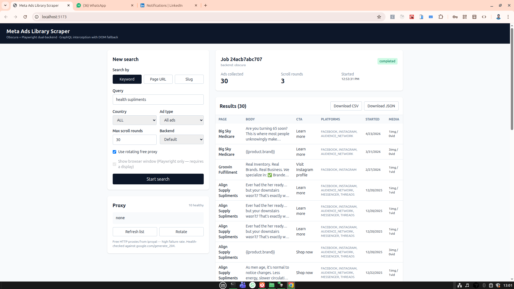

# Meta Ads Library Scraper

Headless-Chrome scraper for the Meta Ads Library. FastAPI backend, React UI,
residential-proxy rotation, four-strategy extraction.



## Architecture

```
React (Vite) ── HTTP ──▶  FastAPI ── CDP ──▶  browserless/chrome ── HTTPS ──▶  facebook.com/ads/library/
                            │
                            ├─ Webshare residential proxy pool
                            └─ Gemini 2.5 Flash (optional, pagination)
```

Extraction layers, merged in priority order:

1. GraphQL XHR interception
2. SSR inline JSON (`<script>` blobs)
3. Live DOM via `page.evaluate`
4. Static HTML via selectolax

## Quick start

```bash
cp .env.example .env       # paste WEBSHARE_PROXIES + optional GEMINI_API_KEY
docker compose up --build
```

Open <http://localhost:5173>.

## Config (.env)

| Env var              | Notes                                                        |
|----------------------|--------------------------------------------------------------|
| `WEBSHARE_PROXIES`   | `host:port:user:pass`, comma- or newline-separated           |
| `GEMINI_API_KEY`     | Enables LLM-driven pagination; otherwise plain scroll        |
| `DEFAULT_COUNTRY`    | Default `ALL`                                                |
| `DEFAULT_MAX_PAGES`  | Default `50`                                                 |

Full list in `.env.example`.

## API

| Method | Path                              |
|--------|-----------------------------------|
| POST   | `/search`                         |
| GET    | `/jobs/{id}`                      |
| GET    | `/jobs/{id}/results?format=json`  |
| GET    | `/jobs/{id}/results?format=csv`   |
| GET    | `/proxies`                        |
| POST   | `/proxies/refresh`                |

`SearchRequest` fields: `input_type`, `value`, `country`, `ad_type`,
`media_type`, `active_status`, `is_targeted_country`, `search_type`,
`sort_direction`, `sort_mode`, `source`, `extra_params`, `max_pages`,
`use_proxy`, `headless`.

## CLI

```bash
docker compose exec api python -m fb_ads_scraper.cli \
  --keyword "solar panels" --country US --max-pages 20 \
  --output /app/output/solar.json
```

## Project layout

```
backend/src/fb_ads_scraper/
├── api.py · cli.py · jobs.py · models.py · config.py
├── search.py                  # orchestrator
├── intercept.py               # GraphQL XHR capture
├── parser.py                  # parse_graphql_payload + DOM fallback
├── browser_extract.py         # live DOM + SSR JSON extractors
├── humanize.py                # bezier-path cursor
├── fb_challenge.py            # __rd_verify_* handler
├── selector_discovery.py      # optional Gemini pagination
├── proxy.py                   # reads WEBSHARE_PROXIES from env
├── exporters.py · retry.py
└── browser/

frontend/src/{App.tsx, api.ts, types.ts, components/}
```

## Gotchas

- Don't override `user_agent` in `new_context()` — fingerprint mismatch
  with the real Chromium version causes FB to serve an empty React shell.
- `spend`, `impressions`, `funded_by`, `demographic_distribution`,
  `eu_total_reach` populate only for political/issue and EU ads.

## License / use

Research / compliance / journalism only. Scraping the Ads Library may
violate Meta's terms.
